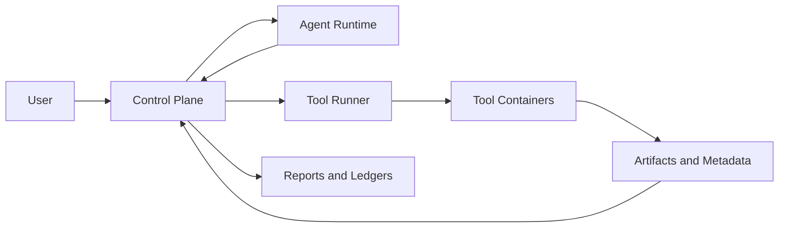

# Autonomous Antibody Affinity Optimization Architecture

## Purpose

This document proposes a repository and runtime architecture for an autonomous
research system inspired by Karpathy's `autoresearch`, but specialized for
iterative antibody affinity optimization.

The core loop is:

1. Start from one antibody-antigen complex structure and its parent sequence.
2. Give an agent access to a toolbox of structural, sequence, and scoring
   methods.
3. Require the agent to choose exactly one antibody point mutation per
   iteration under a strict wall-clock budget.
4. Evaluate the selected mutation with a slower, higher-confidence oracle
   such as Rosetta `flex-ddG`.
5. Accept the mutation if it improves binding relative to the current parent;
   otherwise reject it.
6. Repeat indefinitely until the user stops the campaign.

The repository should make this loop reproducible, inspectable, and easy to
extend with new tools, models, and agent policies.

## Design Principles

- Separate the control plane from the tool execution plane.
- Treat every external method as an isolated, versioned tool container.
- Make every iteration fully auditable: prompt context, tool inputs, tool
  outputs, selected mutation, oracle result, and acceptance decision.
- Optimize for adaptive tool use, not exhaustive tool use.
- Start with a single-machine design that scales to a small local cluster.
- Prefer local filesystem artifacts plus SQLite/DuckDB first; upgrade to
  heavier infrastructure only when it becomes necessary.
- Make agent behavior human-editable through versioned prompt/program files,
  mirroring the spirit of `autoresearch`.

## Scope

### In Scope

- Single campaign over one antibody-antigen complex at a time
- Single amino-acid point mutation per iteration
- Multiple tool classes: structure prediction, inverse folding, refinement,
  language models, proxy scorers, and oracle scoring
- Strict iteration budget enforcement
- Per-tool profiling at campaign start
- Full artifact capture and reproducible replay
- Container-first tool packaging to isolate dependencies

### Out of Scope for the First Version

- Wet-lab integration
- Multi-mutation combinatorial search as a primary mode
- Global sequence redesign as the default search regime
- Distributed scheduling across a large cluster
- Automatic self-modification of the codebase

## Open Design Decisions

The architecture below assumes the following defaults unless you choose
otherwise:

- Mutation scope: any antibody residue except explicitly frozen positions
- Search action: one point mutation per iteration
- Oracle policy: run the oracle only on the final selected mutation each
  iteration
- Deployment target: one GPU workstation, with optional scaling to multiple
  GPUs later
- Agent backend: one primary LLM provider behind an abstraction layer

Questions still worth settling early:

1. Should the default mutable region be all antibody residues or only CDRs
   plus a configurable halo around the interface?
2. Which antibody numbering system should be canonical in reports and prompts:
   PDB residue IDs only, or PDB IDs plus IMGT/AHo/Kabat?
3. Should the oracle ever be spent on a small shortlist for calibration, or
   strictly on the final selected mutation each iteration?
4. Should the first implementation support only heavy or light chain point
   mutations independently, or assume paired heavy/light context throughout?
5. Which LLM backend should be considered the first-class target for the agent
   runtime?

## High-Level Architecture

The system should be split into four layers.



### 1. Control Plane

The control plane is a Python application responsible for:

- campaign setup
- prompt/program assembly
- tool registry lookup
- budget management
- tool execution orchestration
- result validation
- state updates
- reporting

Recommended technology:

- Python 3.12+
- `typer` for CLI entry points
- `pydantic` for typed manifests and run records
- `sqlite` for transactional metadata
- `duckdb` or Parquet for analytics and result summaries

### 2. Agent Runtime

The agent runtime decides what to do within the iteration budget. It should not
invoke containers directly. Instead, it should communicate through a bounded
action interface exposed by the control plane.

Responsibilities:

- read campaign state and recent history
- reason about which residues are promising
- decide which tools to spend budget on
- interpret tool evidence
- choose a single mutation
- provide a concise rationale for the final choice

The agent should operate against a human-editable program file, for example:

```text
programs/default/program.md
```

That file should define:

- the objective
- the decision rubric
- the allowed action schema
- the budget-awareness guidelines
- the mutation safety rules
- the reporting format for rationales

This is the closest analogue to `autoresearch`'s editable research program.

### 3. Tool Execution Plane

Every scientific method should live in its own container image with a standard
manifest and execution contract.

This layer handles:

- dependency isolation
- version pinning
- GPU and CPU resource requests
- timeouts
- cache mounts
- standardized inputs and outputs

Tools should be invoked as short-lived jobs, not long-running services, unless
a specific model benefits materially from a warm server process.

### 4. Data and Artifact Plane

All campaign artifacts should be stored in an immutable, append-only layout on
disk. Metadata should be duplicated in SQLite for indexing and in Parquet for
analysis.

This layer stores:

- original inputs
- normalized structures
- per-tool profiles
- per-iteration prompts and responses
- tool requests and outputs
- oracle evaluations
- acceptance decisions
- campaign summaries

## Core Runtime Concepts

### Campaign

A campaign is one indefinite optimization process over a single starting
antibody-antigen complex.

It owns:

- the current accepted parent sequence and structure
- the immutable starting input
- the mutable-position policy
- the per-iteration time budget
- the tool registry snapshot
- the agent program version

### Iteration

An iteration is one bounded decision cycle that starts from the current parent
state and ends with either:

- an accepted mutation and new parent state, or
- a rejected mutation with the parent state unchanged

### Candidate Mutation

A candidate mutation is a fully specified change:

```text
chain_id + residue_id + wt_aa + mut_aa
```

Internally it should also carry:

- canonical antibody numbering if available
- whether the position is interface-proximal
- prior evidence from past iterations
- tool scores

### Tool Run

A tool run is a single execution of one containerized method on a defined input
payload with explicit runtime parameters.

### Oracle Evaluation

An oracle evaluation is the higher-confidence decision point used to accept or
reject a mutation. It must be treated differently from proxy tools:

- expensive
- authoritative for the accept/reject decision
- always logged with maximal provenance

## Recommended Repository Structure

```text
autoantibody/
├── docs/
│   └── affinity_autonomy_architecture.md
├── programs/
│   └── default/
│       ├── program.md
│       ├── system_prompt.md
│       └── response_schema.json
├── configs/
│   ├── campaign/
│   ├── tools/
│   └── runtime/
├── tools/
│   ├── boltz2/
│   │   ├── Dockerfile
│   │   ├── tool.yaml
│   │   ├── entrypoint.py
│   │   └── README.md
│   ├── chai1/
│   ├── esm_if/
│   ├── ligand_mpnn/
│   ├── rf_diffusion3_relax/
│   ├── openmm_relax/
│   ├── openmm_short_md/
│   ├── esm/
│   ├── balm_paired/
│   ├── foldx/
│   ├── ipsae/
│   └── flex_ddg/
├── src/autoantibody/
│   ├── cli/
│   ├── agent/
│   ├── campaigns/
│   ├── data_models/
│   ├── execution/
│   ├── planning/
│   ├── reporting/
│   ├── storage/
│   ├── tool_registry/
│   └── validation/
├── tests/
│   ├── unit/
│   ├── integration/
│   └── fixtures/
├── scripts/
│   ├── build_tool_images.py
│   ├── run_campaign.py
│   └── replay_iteration.py
└── runs/
    └── campaigns/
```

### Why This Shape

- `programs/` keeps agent behavior versioned and editable without changing
  orchestration code.
- `tools/` makes containerized tool integration explicit and modular.
- `src/autoantibody/` holds orchestration, planning, validation, and reporting.
- `runs/` keeps generated campaign state outside the source tree when desired;
  for local development it can still live here initially.

## Tool Container Contract

Every tool should implement the same contract, regardless of whether it wraps a
deep model, a classical scorer, or a refinement workflow.

### Manifest

Each tool should ship a `tool.yaml` manifest with fields like:

```yaml
name: boltz2
version: 0.1.0
image: autoantibody/boltz2:0.1.0
kind: structure_prediction
entrypoint: ["python", "entrypoint.py"]
requires_gpu: true
default_timeout_s: 1800
estimated_runtime_profile:
  cold_start_s: 20
  small_input_s: 120
  large_input_s: 600
cache_mounts:
  - /cache
inputs:
  schema: schemas/request.json
outputs:
  schema: schemas/result.json
capabilities:
  supports_multimer: true
  supports_fixed_backbone_context: true
  supports_single_mutant_batching: false
```

### Standard Request Payload

Every request should be serialized as JSON or YAML and include:

- campaign ID
- iteration ID
- parent structure reference
- parent sequence reference
- optional candidate mutation list
- tool-specific parameters
- wall-clock timeout
- random seed

Example:

```json
{
  "campaign_id": "cmp_20260317_001",
  "iteration_id": 12,
  "input_structure": "artifacts/current_parent/complex.cif",
  "candidate_mutations": ["H:52:S->Y", "L:91:N->D"],
  "tool_params": {
    "num_recycles": 3
  },
  "timeout_s": 900,
  "seed": 1234
}
```

### Standard Result Payload

Every tool should return a machine-readable result file with:

- status
- timestamps
- wall time
- peak memory if measurable
- GPU usage if measurable
- cache hit metadata
- structured scores
- output artifact paths
- warnings and failure reasons

Example:

```json
{
  "status": "ok",
  "started_at": "2026-03-17T20:15:00Z",
  "ended_at": "2026-03-17T20:18:12Z",
  "wall_time_s": 192.4,
  "cache_hit": false,
  "scores": {
    "iptm": 0.84,
    "interface_pae_mean": 6.1
  },
  "artifacts": {
    "predicted_complex": "outputs/model_0.cif",
    "score_table": "outputs/scores.csv"
  },
  "warnings": []
}
```

### Execution Model

The orchestrator should invoke tools through one runner abstraction, for
example:

- `LocalDockerRunner` for local execution
- `LocalProcessRunner` for development-only mocks
- `SlurmRunner` or `KubernetesRunner` later if needed

The tool runner should be responsible for:

- mounting inputs and outputs
- passing environment variables
- binding cache directories
- applying timeouts
- capturing stdout and stderr
- recording container image digests

## Dataflow

### Campaign Setup Flow

1. User creates a campaign with an input complex structure and metadata.
2. The system normalizes the structure:
   - convert to canonical mmCIF or PDB representation
   - clean chain names
   - map antibody and antigen chains
   - derive residue mappings and antibody numbering
3. The system defines the mutable residue universe.
4. The system runs a one-time tool profiling suite on the initial input to
   estimate runtime and resource cost per tool.
5. The system optionally runs a baseline evidence pass to seed the agent with
   initial scores and embeddings.
6. The system writes the initial campaign state and launches the iteration loop.

### Iteration Flow

1. Load current parent state and recent campaign history.
2. Reserve part of the budget for:
   - oracle execution
   - bookkeeping
   - failure margin
3. Build the agent context:
   - current parent summary
   - mutable positions
   - accepted and rejected mutations so far
   - recent tool ROI statistics
   - per-tool runtime estimates
   - remaining iteration budget
4. The agent produces an action plan, which may include:
   - request shortlist generation
   - run one or more fast tools
   - run one expensive tool on a narrowed shortlist
   - stop early and select a mutation
5. The orchestrator executes allowed actions and returns compact summaries plus
   artifact references to the agent.
6. The agent selects exactly one mutation and emits a rationale.
7. The control plane runs the oracle on that final mutation.
8. The system accepts or rejects the mutation.
9. The parent state, ledger, and reports are updated.
10. The next iteration begins unless the campaign is stopped.

### Parent State Update Rule

The repository should define one deterministic rule for what becomes the
"current parent structure" after an accepted mutation. Otherwise later
iterations will drift into inconsistent state representations.

Recommended rule:

1. The accepted parent sequence always becomes the new sequence state.
2. The accepted parent structure should come from a designated state update
   artifact, not from whichever proxy tool happened to run last.
3. In the first version, use the oracle-produced relaxed mutant structure if it
   is available and structurally valid.
4. If the oracle does not emit a usable structure, run a cheap deterministic
   post-acceptance relax step and store that as the new parent structure.

This keeps the decision oracle and the canonical state-update mechanism aligned
without letting arbitrary proxy outputs redefine the campaign state.

## Budget Management Strategy

This is the critical design problem.

The system should explicitly model tool use as a value-of-information problem
under a fixed per-iteration budget.

### Budget Buckets

Each iteration budget should be partitioned into:

- `oracle_reserve`
- `mandatory_overhead`
- `agent_reasoning_budget`
- `tool_budget`
- `contingency_buffer`

The agent should only be allowed to spend from `tool_budget`.

### Runtime Estimation

Each tool should have:

- initial runtime estimates from the campaign-start profiling run
- moving averages over actual usage in the current campaign
- percentile estimates for safety, especially `p50` and `p90`

The scheduler should expose both expected and pessimistic runtimes to the
agent. Tool calls that would exceed the remaining budget under the pessimistic
estimate should be rejected automatically.

### Suggested Tool Tiers

The planning layer should group tools into coarse tiers:

- `fast`: sequence models, cached embeddings, cheap heuristics, interface
  feature extraction
- `medium`: inverse folding, lightweight refinement, learned scorers
- `heavy`: structure predictors, short MD, learned diffusion relax
- `oracle`: flex-ddG or equivalent

This allows a simple progressive narrowing policy:

1. use fast tools to screen positions and mutation identities
2. use medium tools on a small shortlist
3. use heavy tools only when the expected information gain justifies them
4. always preserve time for the oracle

### Online Tool ROI Tracking

The repository should track how useful each tool has been historically.

Useful summary metrics:

- acceptance rate conditioned on tool usage
- median oracle improvement after using the tool
- compute seconds per accepted mutation
- marginal predictive power over cheaper tools
- frequency of cache hits

These metrics should not replace the agent, but they should be surfaced in the
prompt as an aid for time-aware planning.

## Agent Interface

The agent should interact through a typed action schema rather than raw shell
access.

Recommended actions:

- `list_mutable_positions`
- `read_campaign_summary`
- `read_recent_results`
- `request_tool_run`
- `read_tool_result`
- `select_final_mutation`
- `stop_iteration_early`

### Why Not Give the Agent Arbitrary Shell Access

- It weakens reproducibility.
- It complicates provenance.
- It makes budget accounting unreliable.
- It increases the chance of silent tool misuse.

The control plane can still expose rich tool functionality without giving up
control of execution semantics.

## Scientific Data Model

The internal data model should be explicit and typed.

Recommended models:

- `CampaignConfig`
- `CampaignState`
- `ResidueIdentity`
- `CandidateMutation`
- `ToolManifest`
- `ToolRequest`
- `ToolResult`
- `OracleEvaluation`
- `IterationDecision`
- `AcceptanceEvent`

Important domain fields:

- chain IDs and residue IDs exactly as they appear in the normalized structure
- canonical antibody numbering when available
- parent and mutant sequence hashes
- structure hash
- antigen chain set
- interface residue annotations
- frozen positions
- provenance to source files

## Storage Layout

Recommended on-disk layout for one campaign:

```text
runs/campaigns/<campaign_id>/
├── campaign.yaml
├── input/
│   ├── original_complex.cif
│   ├── normalized_complex.cif
│   └── residue_map.parquet
├── profiling/
│   ├── tool_profiles.json
│   └── <tool_name>/
├── state/
│   ├── current_parent.yaml
│   ├── mutation_ledger.parquet
│   ├── tool_run_ledger.parquet
│   └── campaign.sqlite
├── iterations/
│   ├── 000001/
│   │   ├── context/
│   │   ├── agent/
│   │   ├── tool_runs/
│   │   ├── oracle/
│   │   ├── decision.json
│   │   └── report.md
│   └── 000002/
└── reports/
    ├── campaign_summary.md
    ├── campaign_summary.html
    ├── accepted_mutations.csv
    └── metrics.parquet
```

### Storage Recommendations

- Store raw artifacts on disk.
- Store indexed metadata in SQLite.
- Store analysis-friendly tables in Parquet.
- Use content hashes to avoid duplicate large artifacts.
- Use append-only ledgers for accepted and rejected mutations.

## Caching Strategy

Caching is necessary both for speed and for controlling compute cost.

The control plane should support:

- shared model-weight caches mounted into containers
- per-tool persistent caches
- artifact deduplication by input hash
- optional reuse of features or embeddings across iterations

Examples:

- ESM or BALM embeddings for the unchanged parent context
- repeated structure preprocessing outputs
- shortlists that differ only by one mutation identity
- fixed antigen-side features reused across the campaign

Every cache hit should be recorded so tool ROI metrics remain interpretable.

## Logging and Observability

Logging should be designed for both debugging and scientific auditability.

### Structured Event Log

Each campaign should maintain a JSONL event stream, for example:

```text
runs/campaigns/<campaign_id>/state/events.jsonl
```

Every event should include:

- timestamp
- campaign ID
- iteration ID
- event type
- actor (`system`, `agent`, `tool_runner`, `oracle`)
- payload

Useful event types:

- `campaign_started`
- `tool_profile_completed`
- `iteration_started`
- `budget_allocated`
- `tool_requested`
- `tool_started`
- `tool_finished`
- `tool_failed`
- `mutation_selected`
- `oracle_finished`
- `mutation_accepted`
- `mutation_rejected`
- `campaign_stopped`

### Per-Tool Logs

Each tool run should capture:

- `stdout.log`
- `stderr.log`
- structured `result.json`
- resource usage summary

### Agent Logs

The repository should save:

- system prompt version
- program file version
- rendered context payload
- model response
- parsed action sequence
- final rationale

This is critical for later analysis of why the agent made specific decisions.

### Metrics to Track

- wall time per iteration
- tool wall time and queue time
- GPU memory and GPU seconds if available
- cache hit rates
- accepted mutation rate
- cumulative best oracle score
- score drift over time
- tool failure rates

## Results Reporting

The system should generate reports at two levels.

### Iteration Reports

Each iteration report should include:

- parent sequence and structure identifiers
- remaining budget at each decision point
- tools used and their runtimes
- mutation shortlist considered
- final selected mutation
- oracle result
- accept/reject decision
- concise rationale

### Campaign Reports

Campaign-level reporting should include:

- all accepted mutations in chronological order
- best-so-far mutation path
- oracle score trajectory over time
- accepted versus rejected counts
- tool usage frequencies
- compute spent per accepted improvement
- top-performing positions and amino-acid substitutions
- tool calibration statistics against the oracle

Recommended outputs:

- Markdown summaries for humans
- HTML reports for quick browsing
- CSV or Parquet tables for downstream analysis

## Failure Handling and Safety

The orchestration layer should assume tools will fail sometimes.

Required behaviors:

- hard timeout per tool call
- structured failure reporting
- partial artifact preservation when useful
- automatic budget adjustment after failures
- retry only when failure modes are clearly transient
- never accept a mutation without an oracle result

### Mutation Safety Checks

Before oracle evaluation, validate that the selected mutation:

- changes exactly one antibody residue
- does not target a frozen position
- matches the current parent residue identity
- uses a standard amino acid unless noncanonical residues are explicitly
  enabled

## Reproducibility and Provenance

Every campaign should be replayable.

Record the following for every iteration:

- normalized input structure hash
- parent sequence hash
- selected mutation ID
- container image digests
- tool manifests
- random seeds
- runtime parameters
- prompt/program version
- LLM model identifier

Reproducibility standards:

- pin container images by digest, not only by tag
- copy the exact tool manifest into each run directory
- avoid network downloads during execution when possible
- pre-bake or pre-cache model weights

## Deployment Model

### Recommended First Deployment

A single GPU workstation with:

- Docker or Podman
- NVIDIA Container Toolkit if GPUs are needed
- local filesystem storage
- SQLite plus DuckDB

This keeps the first version operationally simple while still supporting the
container-per-tool design.

### Scaling Path

If a multi-GPU or small-cluster environment becomes necessary, keep the same
logical architecture and replace only the runner backend:

- local Docker -> Slurm job runner
- local filesystem -> shared filesystem or object store
- SQLite -> Postgres if concurrent writers become a problem

## Minimal Viable Build Order

The fastest path to a useful system is incremental.

### Phase 1: Contracts and Simulation

Build:

- campaign data models
- tool manifest schema
- local runner
- agent action schema
- event logging
- one fake fast tool and one fake oracle

Goal:

- prove the orchestration loop, reporting, and budget accounting

### Phase 2: First Real Scientific Loop

Add:

- one sequence model
- one cheap interface scorer
- one structure-aware method
- one real oracle wrapper

Goal:

- run end-to-end on one real antibody-antigen complex

### Phase 3: Richer Tool Portfolio

Add:

- Boltz-2
- Chai-1
- ESM-IF
- LigandMPNN
- OpenMM relax or short MD
- one learned relax method

Goal:

- let the agent make meaningful budget tradeoffs

### Phase 4: Analytics and Smarter Planning

Add:

- tool ROI dashboards
- cache-aware planning
- shortlist calibration reports
- optional oracle calibration mode

Goal:

- improve mutation quality per unit compute

## Recommended Initial Implementation Choices

To keep the first version tractable, I recommend:

- Python control plane with Pydantic models
- Docker-based tool execution
- local filesystem artifacts under `runs/`
- SQLite for metadata
- Parquet for mutation and tool ledgers
- one editable `program.md` file controlling agent behavior
- one real oracle wrapper and two to four proxy tools before integrating the
  full tool suite

## Summary

The repository should be organized around three stable interfaces:

1. a human-editable agent program
2. a uniform tool container contract
3. an append-only, fully auditable campaign data model

That combination gives you the main benefit of the `autoresearch` style:
iterate on the research policy quickly while keeping execution reproducible and
scientifically inspectable.
